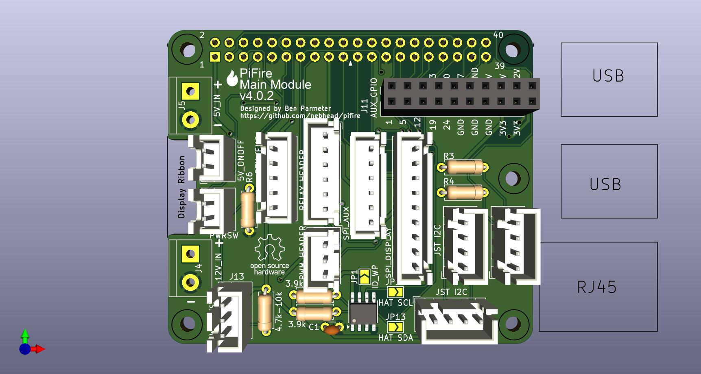
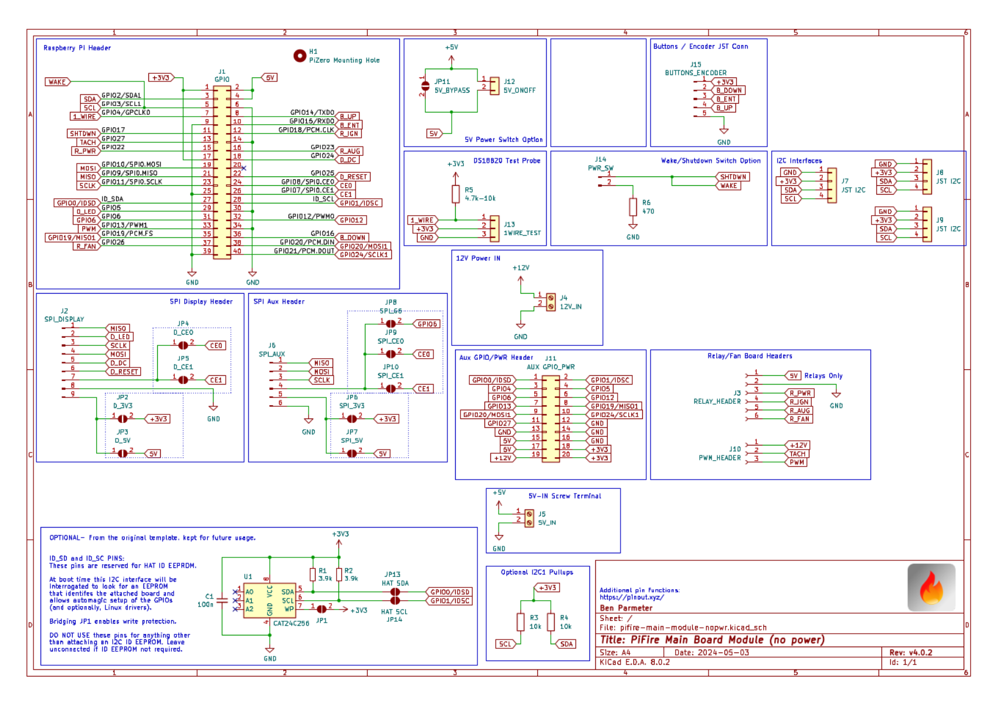
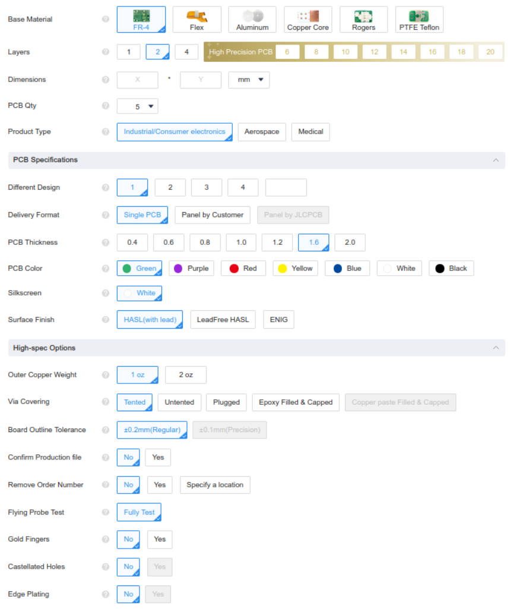

# PiFire Main Module PCB (v4.x.x) KiCad Files

## What is this? 

This PCB provides a modular approach to building your PiFire Smart Smoker Controller.  This board breaks out the many interfaces that are commonly used to support sensors, relays, displays and other devices.  This design allows the user to choose features that suit their needs such as using a PWM DC Fan instead of the AC fan system, or allows for different and expanded probe devices.  Some other notable features are the addition of a 1-Wire bus connector, a wake/shutdown option, and more!  

__Important Notes:__  
1. This board requires v1.8.x of PiFire or later.  As of May 2024, this version is still in development and can be tested by switching to the development branch in the updater page.  Ensure you run through the configuration wizard to select the v4.x.x board and configure your specific settings appropriately. 
1. This board does NOT support the selector switch to run in parallel with the OEM controller.  The pin used for this purpose has been repurposed for the wake/shutdown feature. 

The design intent for this board was to make a DIY accessible PCB that can be more easily put together by the maker/enthusiast of almost any skill level.  Full size components are used in most cases and most (if not all) parts should be readily available to order online.  See the Interactive BOM for more details about the parts used and links to order.

### What is PiFire? 

PiFire is a SBC based Pellet Smoker Controller.  More details can be found [here](https://nebhead.github.io/PiFire) or [at the GitHub repo](https://github.com/nebhead/pifire). 

## What's in this Repository?

### KiCad Project Files 
In this repository you will find the latest KiCad design files for the  PCB.  Simply load the project file (.kicad_pro) into the KiCad software and you should be able to edit as needed.  Or if you just want to get this board made, jump to the production section below.

### Interactive BOM

There is an interactive BOM located in the [/bom](bom/) folder which details the parts and provides some pin information as well.  Use this to gather the components you may need to build this board out and refer back to it for placement help.    

[BOM + Pin Info](https://nebhead.github.io/pifire-main-module-nopwr)

_This is a standalone HTML file that was autogenerated by the excellent plugin for KiCad. See the plugin here: [https://github.com/openscopeproject/InteractiveHtmlBom](https://github.com/openscopeproject/InteractiveHtmlBom)_

### PDF of the Schematic

Preview the schematic in PDF format here: [Schematic](schematic.pdf)

### JLCPCB Production Files

If you wish to get these PCBs made by JLCPCB, the production files are provided in the `/production` folder.  For convenience, the file `production.zip` can simply be uploaded to JLCPCB to make it super easy to order boards.

Drop the zip file onto the order page, wait for it to upload then simply continue to order the board.  Optionally, select different board color, PCB quantity, surface finish, etc.  Most of the default settings should be sufficient. 

